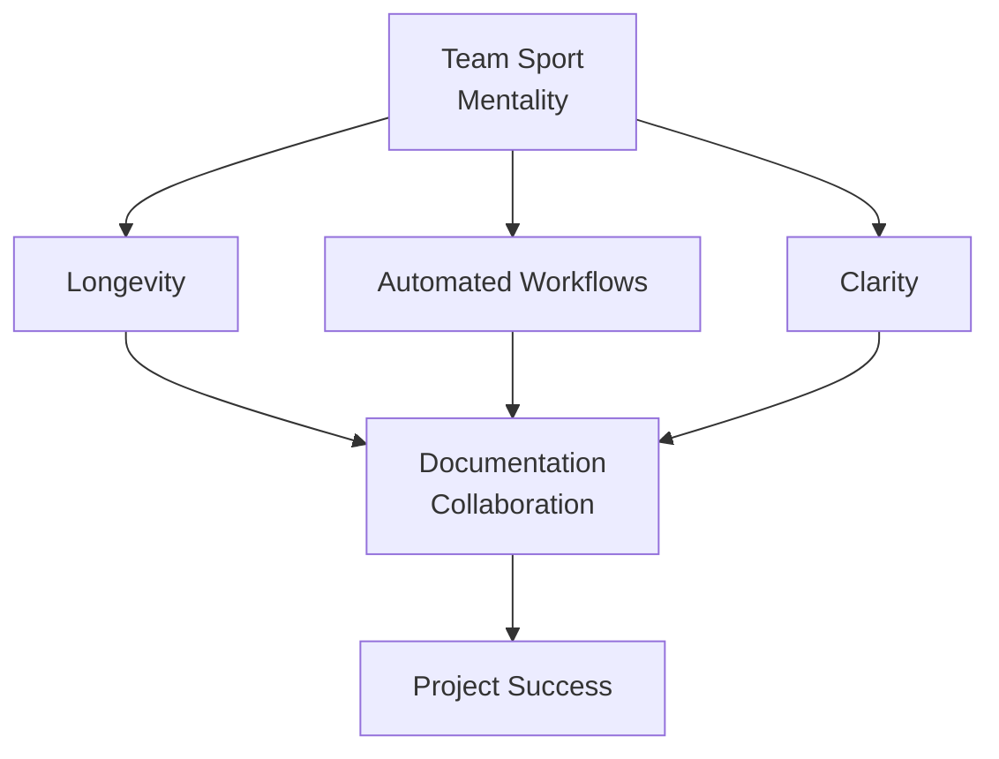

## Overview
- Project Backbone
- Trained for Paper
- Big Picture
- Collaboration Benefits
- Best Practices
- Process Workflow
- Markdown and Mermaid
- Process Steps
- Jenkins CI/CD
- Next Steps
- Summary
- Key Takeaways

---

## The Big Picture

