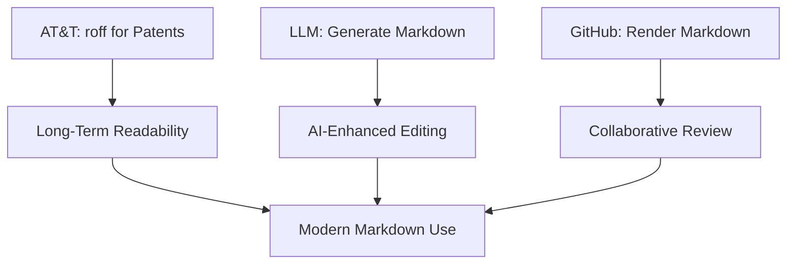
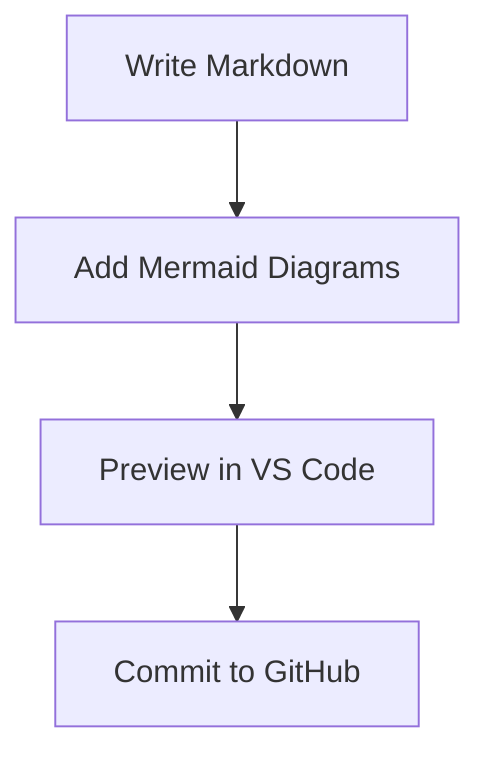
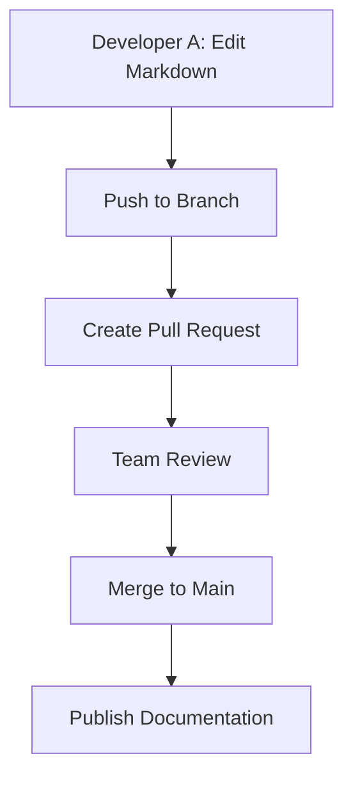
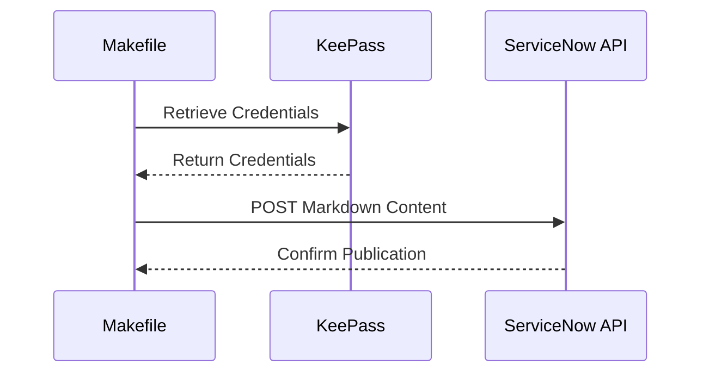

## Why Documentation Matters

- Documentation is the backbone of project success.
- Enables knowledge sharing, onboarding, and maintenance.
- Poor documentation leads to confusion and inefficiency.
- Team collaboration ensures accuracy and relevance.

------

## The Team Sport Mindset

- Everyone contributes: developers, writers, and stakeholders.
- Collaborative tools streamline the process.
- Version control and automation enhance efficiency.
- Goal: Create living, maintainable documentation.

------

## Workflow Overview

- Tools: VS Code, Markdown, Mermaid, Pandoc, GitHub, ServiceNow, KeePass.
- Steps: Write Markdown, preview diagrams, convert to HTML/PDF, collaborate, and publish.
- Focus on simplicity, integration, and longevity.

------

## Benefits of Markdown

- Longevity: Lightweight markup ensures durability (e.g., AT&T’s roff for patents in the 1970s, still readable today).
- LLM Integration: Markdown’s simplicity enables AI-assisted editing and generation (e.g., Grok 3 for content suggestions).
- GitHub Rendering: Native support for Markdown and Mermaid diagrams in GitHub for seamless collaboration.
- Markdown: Structured, portable, and future-proof format.

------

## Markdown Benefits Workflow



------

Step 1: Write VS Code using Markdown

- Use VS Code with the Markdown Preview Mermaid Support plugin.
- Write documentation in Markdown for simplicity.
- Mermaid diagrams for visual workflows.
- Preview diagrams in real-time for accuracy.

------

## Mermaid Diagram Example



------

Step 2: Convert Markdown with Pandoc

- Pandoc converts Markdown to HTML, PDF or other formats.
- Use mermaid-filter to render Mermaid diagrams.
- Command: `pandoc -F mermaid-filter -t beamer input.md -o output.pdf`
- Ensures diagrams are embedded in the final document.

------

Step 3: Styling with CSS from .docx

- Create a .docx file with desired styles (e.g., fonts, colors).
- Convert .docx to CSS using tools like docx2css.
- Apply CSS to HTML output for consistent formatting.
- Example: Define heading styles, font sizes, and colors.

------

Step 4: Collaboration with GitHub

- Host Markdown files in a GitHub repository.
- Use pull requests for team reviews and edits.
- Track changes and maintain version history.
- Mermaid diagrams render natively on GitHub.

------

## GitHub Collaboration Workflow



------

Step 5: Publishing to ServiceNow KB

- Use ServiceNow Knowledge Base API to publish documentation.
- Automate content updates with Makefiles and scripts.
- Store API credentials securely in KeePass.
- Ensure documentation is accessible to stakeholders.

------

## ServiceNow API Integration



------

Step 6: Automating with Makefile

- Create a Makefile to automate conversions.
- Example tasks: Convert Markdown to HTML/PDF, push to GitHub, etc.
- Simplifies repetitive tasks for the team.
- Command: `make pdf , make html, or make push`

------

## Makefile Example

```makefile
pdf:
    pandoc -F mermaid-filter -t beamer input.md -o output.pdf
html:
    pandoc -F mermaid-filter --standalone --css=styles.css input.md -o output.html
push:
    git add . && git commit -m "Update docs" && git push
```

------

## Conclusion

- Documentation thrives with team collaboration.
- Markdown’s longevity, LLM integration, and GitHub rendering enhance workflows.
- Tools like VS Code, Pandoc, GitHub, and ServiceNow streamline the process.
- Mermaid diagrams add clarity and engagement.
- Let's make documentation a team sport!

