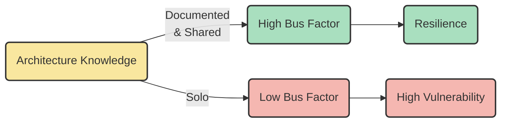
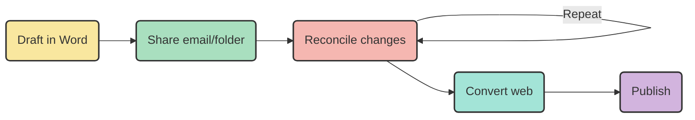
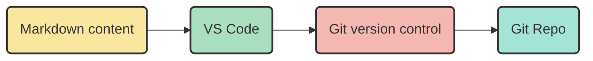
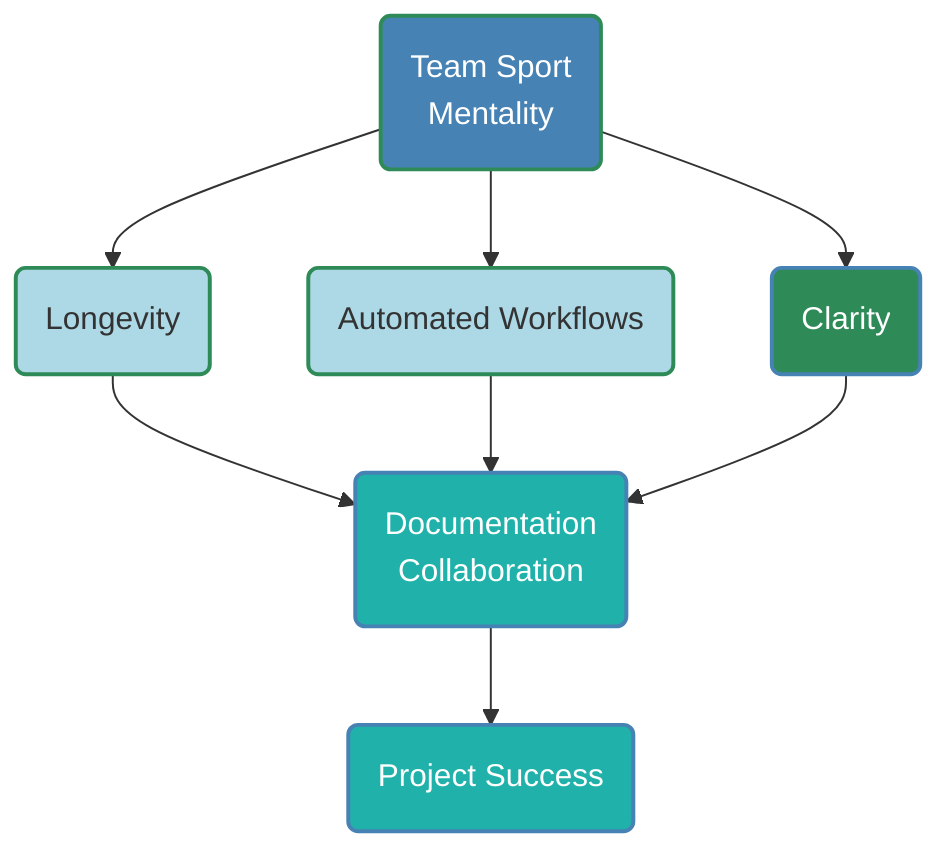
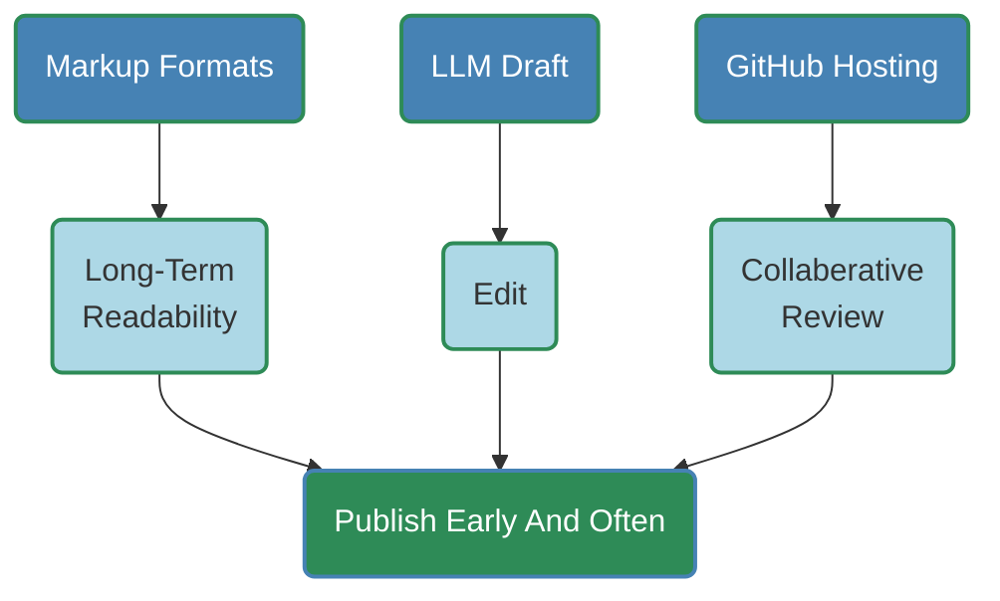
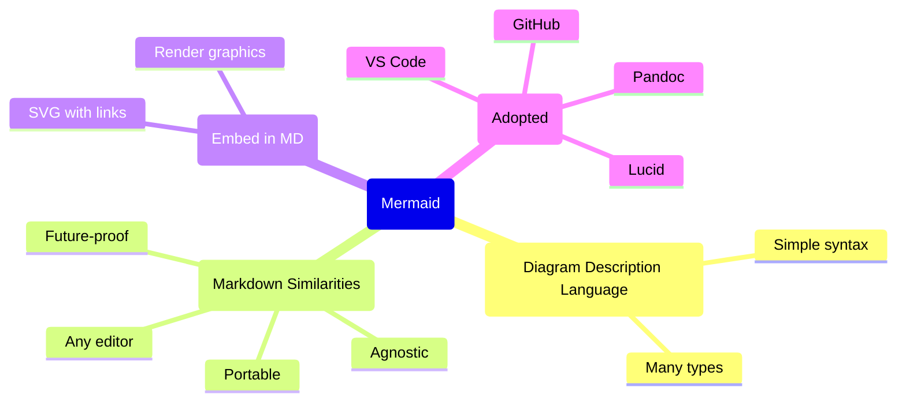
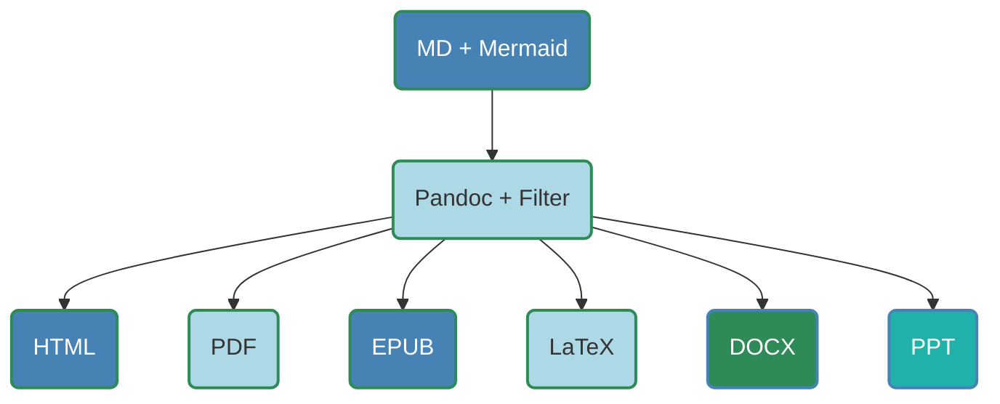
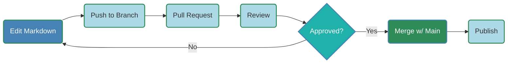
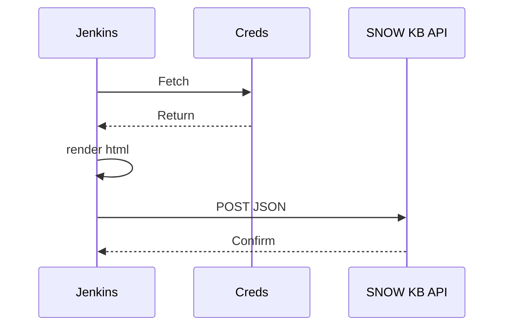

## Overview

- Project Backbone
- Knowledge Sharing
- Pitfalls of Poor Documents
- Bus Factor Risks
- Trained for Paper (Issue)
- Collaboration Benefits
- User Experience Boost
- Document Best Practices
- Document Life Cycle
- Team Sport Mindset
- Workflow Tools

---

## Overview (cont)

- Markdown Authoring
- Mermaid Diagrams
- VS Code Editing
- Pandoc Conversion
- CSS Styling
- GitHub Collaboration
- Makefile Automation
- SNOW KB Publishing
- Next Steps
- Summary
- Key Takeaways

---

## Documentation: Successful Project Backbone

- **Clarity:** Aligns team goals, processes, tech details.
- **Scalability:** Guides new contributors as projects grow.
- **Decisions:** Tracks "*the why*" to avoid repeated errors.
- **Risks:** Ensures compliance in regulated fields.

**Example**: API docs enable seamless integration, reduces debugging.

---

## Knowledge Sharing & On-boarding

- **Democratizes info:** Reduces expert dependency.
- **Speeds on-boarding:** Quickly grasp workflows/tools.
- **Aids maintenance:** Simplifies troubleshooting.
- **Future-proofs:** Preserves knowledge amid changes.

**Example**: README with examples onboards engineers more quickly.

---

## Poor Documentation Pitfalls

- **Confusion:** Leads to errors, miscommunication.
- **Inefficiency:** Time wasted reverse-engineering.
- **Knowledge loss:** Gaps when experts leave (bus factor).
- **Costs:** Builds technical debt, rework.

**Example**: Undocumented code wastes hours on logic decoding.

---

## Bus Factor Defined

- **Measure:** Key individuals whose absence stalls project.
- **Low (1-2):** High risk, concentrated knowledge.
- **High (5+):** Resilient, distributed info.
- **Link to Docs:** Poor docs lower factor; good docs raise it.

**Mitigation**:

- Document processes/code/decisions.
- Cross-train teams.
- Use wikis/Git repos.
- Pair programming/code reviews.



---

## We've Been Trained for Paper

**Credit**: Ben Balter (2012)  
**Source**: [We've been trained to make paper](https://ben.balter.com/2012/10/19/we-ve-been-trained-to-make-paper/)

- Trained for printed paper, not web/digital.
- Word: 1980s print focus (margins, breaks); weak on hyperlinks, responsiveness.
- Digital dominance: Most documentation consumed online.

---

## Flawed Paper Tools Workflow

### Legacy process:

**Steps**:

1. Draft in Word.
2. Share email/folder.
3. Reconcile manually.
4. Repeat to finalize.
5. Convert to web format.
6. Publish.

**Issue**: Paper-first; web retrofit.



---

## Analogy: Water from filtered Coke is inefficient.


---

## **Hello World!** in Markdown

<center>

```text
**Hello World!***
```

</center>
    
---

## **Hello World** in MS Word XML
```xml
<?xml version="1.0" encoding="UTF-8" standalone="yes"?>
<w:document xmlns:w="http://schemas.openxmlformats.org/...">
    <w:body>
        <w:p>
            <w:r>
                <w:rPr>
                    <w:b/>
                </w:rPr>
                <w:t>Hello World!</w:t>
            </w:r>
        </w:p>
    </w:body>
</w:document>
```
**Any Questions?**

---

## Solution: Version Control & Web-First

**Version Control**:

- **Git**: (2005) tracks changes (character-level), branches, discussions.
- **Free**: DevOps Staple.

**Web-first flow**:

1. **Markdown**: Text-based content.
2. **Tools**: VS Code (edit).
3. **Git**: Version control.
4. **Git Repo**: Review, collaborate.



- **Shift**: Web-first; pure content in Markdown.
- **Break** proprietary traps: focus on document essence.

**Credit**: Ben Balter (2012).

---

## The Big Picture



---

## Collaboration Benefits

**Teams Deliver**:

- **Accuracy**: Multi-perspectives identify documentation gaps.
- **Relevance**: Tailors for devs/users.
- **Improvement**: Git/wikis for updates.
- **Ownership**: Shared maintenance.

**Example**: Cross-team document store ensures comprehensive docs.

**Benefits**:

- **Empowerment**: Self-service guides reduce support dependencies.
- **Trust**: Professional documents reflect quality.
- **Reduced errors**: Intuitive instructions.
- **Adoption**: Easy learning boosts uptake.

**Example**: Relevent SOP reducing ticket count.

---

## Best Practices

**Good Documentation**:

- **Concise**: Simple language, visuals.
- **Organized**: Logical structure, searchable.
- **Updated**: Living docs, with assigned owners.
- **Templated**: Standardized (READMEs, SOPs, APIs).
- **Tested**: User validated.

**Documentation Life Cycle**

```mermaid
graph LR
    A(Plan: Requirements/specs) --> B(Code: Code/APIs)
    B --> C(Build: Processes)
    C --> D(Test: Cases/results)
    D --> E(Release: Notes)
    E --> F(Deploy: Steps)
    F --> G(Operate: Runbooks)
    G --> H(Monitor: Metrics/incidents)
    H --> A

    classDef plan fill:#FFD700,stroke:#333,stroke-width:2px;
    classDef code fill:#1E90FF,stroke:#333,stroke-width:2px;
    classDef build fill:#32CD32,stroke:#333,stroke-width:2px;
    classDef test fill:#FF4500,stroke:#333,stroke-width:2px;
    classDef release fill:#9932CC,stroke:#333,stroke-width:2px;
    classDef deploy fill:#00CED1,stroke:#333,stroke-width:2px;
    classDef operate fill:#FF69B4,stroke:#333,stroke-width:2px;
    classDef monitor fill:#FFA500,stroke:#333,stroke-width:2px;

    class A plan;
    class B code;
    class C build;
    class D test;
    class E release;
    class F deploy;
    class G operate;
    class H monitor;
```



---

## Process Workflow

**Team Sports Mindset**

- **All members contribute**: Devs, writers, users.
- **Tools**: To Streamline collaboration.
- **Versioning/Automation**: Provide efficiency.
- **Goal**: Accurate, living, maintainable docs.

**Workflow Overview**

- **Input**: SMEs, feedback.
- **Tools**: VS Code, Markdown, Mermaid, Pandoc, GitHub.
- **Steps**: Write, preview, collaborate, convert, publish.
- **Focus**: Simplicity, integration, CI/CD.

---

## Markdown: Core Authoring



---

## Mermaid: Mind Map



---

## Step 1: VS Code Content Creation


- **Extensions**: Markdown Preview Mermaid.
- Add diagrams/workflows.
- Paste screenshots/links.
- Real-time preview.

---

## Step 2: Pandoc Conversion



- Renders to formats.
- YAML metadata.
- Command:

```bash
pandoc -F mermaid-filter in.md -o out.html
```

---

## Step 3: CSS Styling

- **From Word**: Save as HTML, extract CSS.
- **Tool**:
```bash
pip install html2css
html2css -i html -o css
```
- Apply: `--css=style.css`.
- Controls: Fonts, colors, headings.

**Command**:
```bash
pandoc -F mermaid-filter --css=style.css in.md -o out.html
```

---

## Step 4: GitHub Collaboration



- **Repo hosted**: Change Tracking.
- **Pull Request**: Reviews/Approves.
- **Preview**: Native Markdown and Mermaid rendering.

---

## Step 5: Makefile Automation

- Tasks: html, push, all.
- Example:

```makefile
.PHONY: all push html

all: push html

html: 
	pandoc -F mermaid-filter -s --css=my.css in.md -o in.html

push:
	git commit -am "Update docs" && git push
```

- Run:
```bash
make
```

---

## Step 6: SNOW KB Publishing

- **Manual**:
    - Paste HTML </>
    - Update KB
    - Preview KB
    - Upload images
    - Submit KB for review
- **Auto**: Jenkins CI/CD
    - Checkout
    - Build (make html)
    - POST to API
    - Secrets: Jenkins Credentials
- **Alternatives**:
    - Makefile, Curl, KeePass
    - GitHub Actions (YAML workflow, API POST)

---

## Jenkins CI/CD Pipeline Example



---

## Next Steps

- **CI/CD Pipeline**: Jenkins POC to automatically render and publish.
- **Alt CI/CD**: Enable GitHub Actions for simpler automation.
- **Leverage AI**: Drafts, templates, classification taxonomy.
- **Investigare**: Process improvements.
- **Indexing**: Leverage Decision trees, mind maps; categorize attributes.

---

## Summary


---

## Key Takeaways

- **Strategic asset**: Sharing, on-boarding, maintenance.
- **Avoid pitfalls**: Confusion, costs.
- **Collaboration**: Accuracy, improved user experience.
- **Mindset**: Team Sport.
- **Tools**: Markdown, Mermaid, VS Code, Pandoc, GitHub, Automation.

**Action**:

- **Invest**: Retool legacy document workflows.
- **ROI**: Repeatable processes, reduced time, effort and empowered teams.
