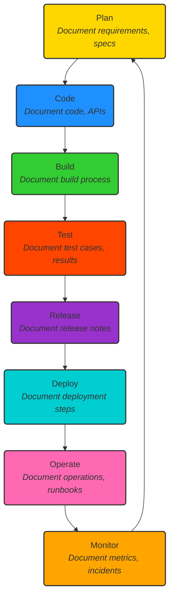
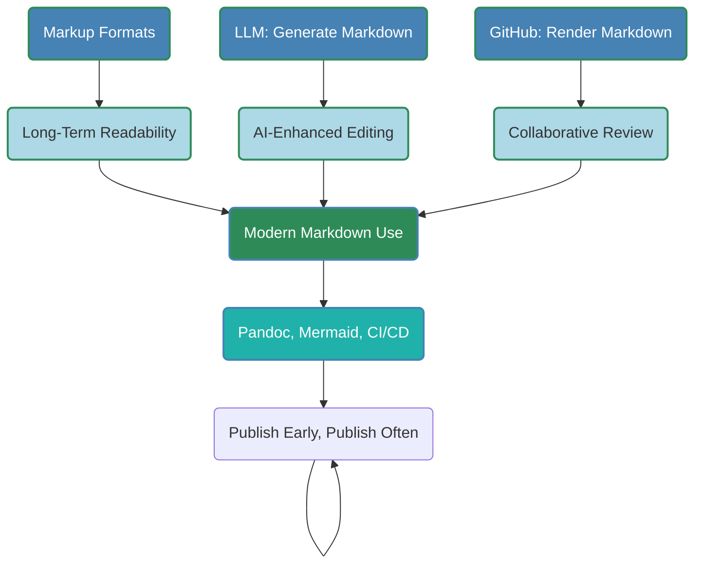
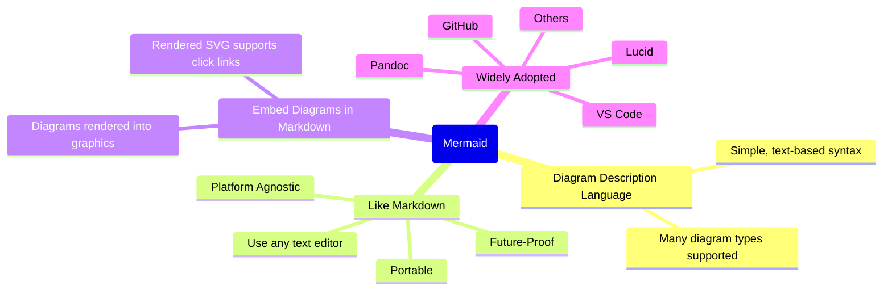
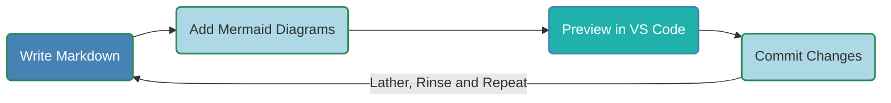
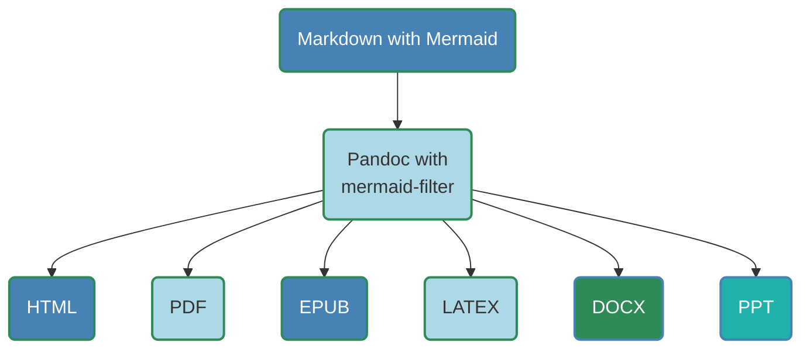
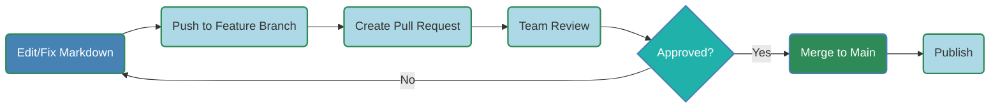
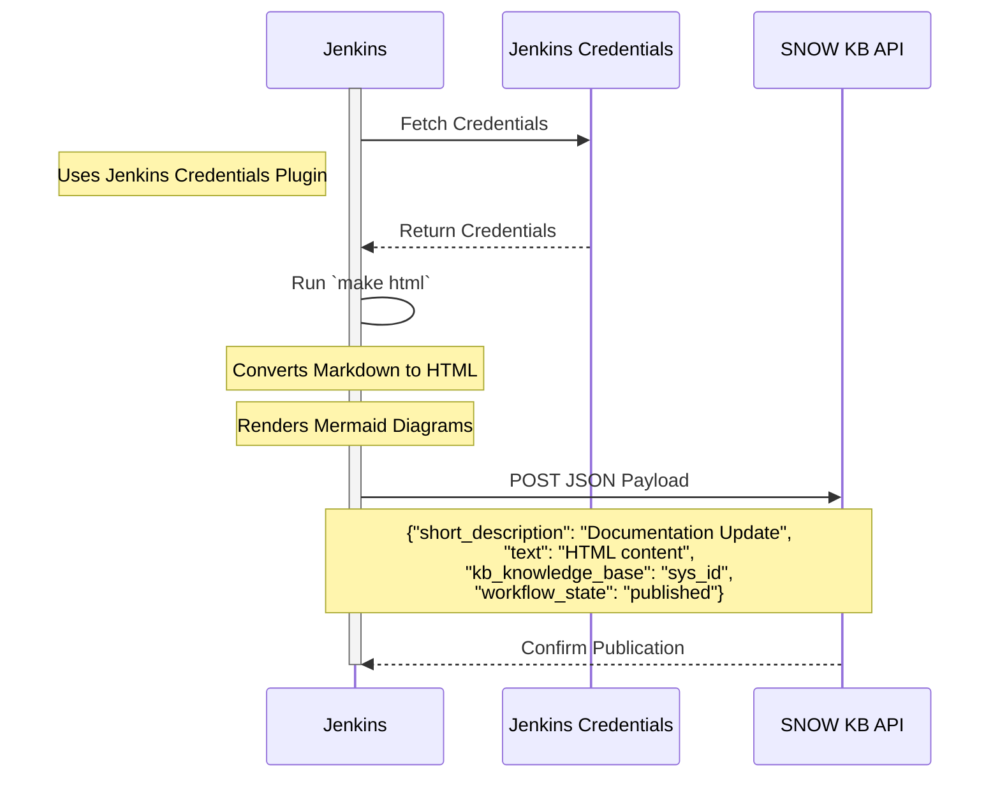
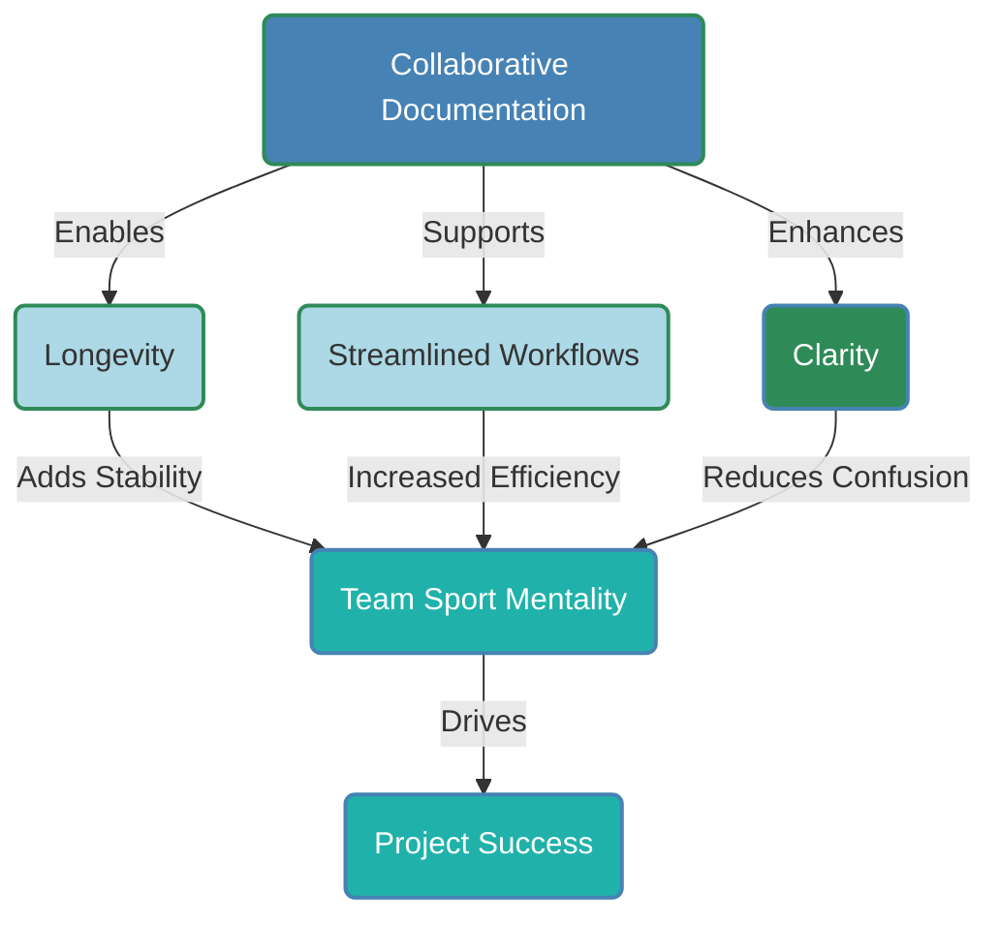

## Overview

- Why Documentation Matters
- Backbone of Successful Projects
- Enables Knowledge Sharing
- Consequences of Poor Documentation
- Collaboration for Effective Documentation
- Enhances User Experience
- Best Practices
- Key Takeaways
- Suggested Tooling and Processes

---

## Documentation: The Backbone of Success

- **Clarity and Alignment**: Ensures team members understand goals, processes, and technical details.
- **Scalability**: Supports project growth by guiding new contributors.
- **Decision Tracking**: Captures the *why* behind choices, avoiding repeated mistakes.
- **Risk Mitigation**: Ensures compliance in regulated industries, reducing risks.

**Example**: Clear API documentation enables developers to integrate systems without guesswork, saving time.

---

## Knowledge Sharing and Onboarding

- **Democratizes Knowledge**: Reduces reliance on individual experts, fostering autonomy.
- **Accelerates Onboarding**: Helps new hires grasp workflows and tools quickly.
- **Supports Maintenance**: Simplifies troubleshooting with clear guides.
- **Future-Proofs Projects**: Preserves knowledge as teams or technologies evolve.

**Example**: A README with setup instructions can onboard a new engineer in days, not weeks.

---

## Pitfalls of Poor Documentation

- **Confusion**: Ambiguous or missing docs lead to miscommunication and errors.
- **Inefficiency**: Teams waste time searching for answers or reverse-engineering existing systems.
- **Knowledge Loss**: Departure of key members creates gaps ("\hyperlink{bus-factor}{\textbf{bus factor}}").


- **Increased Costs**: Technical debt accumulates, requiring costly rework.

**Example**: Unclear code without comments forces developers to spend hours deciphering logic.

---

## Collaboration Ensures Quality

- **Accuracy**: Multiple perspectives catch errors and fill gaps.
- **Relevance**: Tailors content to diverse audiences (e.g., users vs. developers).
- **Continuous Improvement**: Collaborative tools like GitHub and wikis keep docs up-to-date.
- **Shared Ownership**: Encourages teams to maintain and refine documentation.

Example: A wiki with contributions from developers, designers, and support ensures comprehensive docs.

---

## Enhances User Experience

- **Empowers Users**: Clear guides and FAQs enable self-service, reducing support queries.
- **Builds Trust**: Professional documentation reflects product quality.
- **Reduces Frustration**: Intuitive instructions prevent user errors.
- **Supports Adoption**: Well-documented products are easier to learn, boosting uptake.

**Example**: A clear user manual for a software tool reduces support tickets by guiding users.

## Best Practices for Documentation

- **Clear and Concise**: Use simple language and visuals (e.g., diagrams, screenshots).
- **Organized and Searchable**: Structure content logically and use searchable platforms.
- **Regular Updates**: Treat documentation as a living resource, assign owners.
- **Use Templates**: Standardize formats for consistency (e.g., READMEs, API docs).
- **Test It**: Validate docs with new users for clarity and accuracy.


## Key Takeaways

- Documentation is a strategic asset for project success.
- Enables knowledge sharing, onboarding, and maintenance.
- Poor documentation causes confusion and inefficiency.
- Collaboration ensures accuracy and relevance.
- Enhances user experience and product adoption.

**Call to Action**: Invest in documentation early and collaboratively to save time, reduce costs, and empower your team and users.

---

## Documentation Life Cicle



---

## The Team Sport Mindset
- Everyone contributes: developers, writers, consumers.
- Collaborative tools streamline workflows.
- Version control and automation boost efficiency.
- Goal: Living, maintainable, up-to-date documentation.

---

## Workflow Overview
- **Input**: Subject Matter Experts, feedback loops.
- **Tools**: VS Code, Markdown, Mermaid, Pandoc, GitHub.
- **Steps**: Write, preview, collaborate, convert, publish.
- **Focus**: On simplicity, structure, integration, longevity.
- **CI/CD**: Continuous Integration/Continuous Delivery

---

## What is Markdown?
- **Markdown**: A lightweight markup language.
- **Decarate Text**: Adds structure and formatting.
- **WYSIWYM**: What You See Is What You Meant.
- **Formatted Text**: Determines structure and format.
- **Platform Independent**: Create using any text editor.

## Benefits of Markdown
- **Human Readable**: Displayed text easily comprehended.
- **Longevity**: Markup languages are lightweight, durable.
    - Runoff (1960s), Postscript (1982), \LaTeX (1984)
- **LLM Integration**: LLM suggestions, editor plugins.
- **GitHub Rendering**: Native Markdown/Mermaid support.
- **Fewer Distractions**: Focus on pure essense of document.
- **Attributes**: Structured, portable, future-proof.
- **History**: Word processors fade; Markup languages endure.

---

## Markdown Benefits Diagram


---

## What is Mermaid?
- Mermaid is a Diagram Description Language.
- Uses simple, text based-syntax.
- Like Markdown, create diagrams using any text editor.
- Diagrams easily added to Markdown documents.
- Embedded Mermaid diagrams rendered into graphics.
- Wide Adoption: Supported by Lucid, GitHub, Pandoc, etc.

---

## What is Mermaid (cont)?

### Mermaid Mind Map


---

## Sample Mermaid Diagram Types
- Sequence Diagram - Actor/Object interaction over time.
- Gantt Chart - Represents project schedules and tasks.
- Flowchart - Visualizes processes or workflows.
- Class Diagram - Models class structures and relationships.
- State Diagram - Represents state machines.
- Entity-Relationship Diagram - Database relationships.
- User Journey Diagram - User interactions and experiences.
- Mindmap - Displays hierarchical information.
- Timeline - Shows events in chronological order.
- Requirement Diagram - System requirements.
- Git Graph - Visualizes Git repository commit history.
- Pie Chart - Shows data in a circular, proportional format.
- Quadrant Chart - Compares data in four quadrants.
- Sankey Diagram - Shows flow magnitudes between nodes.
- Block Diagram - System component interactions.
- C4 Diagram - Architecture models.

---

## Step 1: Create Content in VS Code


- Use VS Code with Markdown Preview Mermaid Support.
- Write Markdown for simplicity.
- Add Mermaid diagrams for workflows, etc.
- Paste screenshots from clipboard.
- Add other images as Markdown links.
- Preview diagrams and images in real-time.
- Commit Changes to GitHub.
- For Best Results: Lather, Rinse and Repeat.


---

## Step 2: Pandoc Conversion Tool

- Renders Markdown to HTML, PDF, EPUB, etc.
- Uses `mermaid-filter` for diagram rendering.
- YAML formatted metadata values in document header.
- Example Command:

```bash
pandoc -F mermaid-filter -t html in.md -o out.html
```

---

## Step 3: CSS Styling
- Create Word document with styles (fonts, colors).
- Convert DOCX to HTML via Save As.
- Extract CSS from HTML style section.

```bash
pip install html2css
html2css --input saved_as.html --output style.css
```
- Apply to HTML: `pandoc --css=style.css`.
- Controls: headings, fonts, font sizes, colors, etc.
- Example Command:

```bash
pandoc -F mermaid-filter                           \
       --css=style.css                             \
       --to html                                   \
       --out out.html in.md
```

---

## Step 4: GitHub Collaboration



- Host Markdown in GitHub repository.
- Use pull requests for reviews, edits.
- Track changes, maintain history.
- Native Markdown/Mermaid rendering.

---

## Step 5: Makefile Conversion Automation
- Automates conversions, Git operations.
- Tasks: all, html, push.
- Commands: `make all`, `make html`, `make push`.

```makefile
.PHONY: all html push

all: pdf push

html: 
	pandoc -F mermaid-filter -s --css=styles.css      \
    in.md -o in.html

push:
	git commit -m "Update docs" -a && git push
```

---

## Step 6: SNOW KB Publishing
- **Manual**: Process Follows:
    - **Paste** HTML into SNOW KB editor
    - **Update**
    - **Preview**
    - **Upload images**
    - **Submit** for review
- **Automatic**: Jenkins CI/CD Pipeline:
  - **Checkout**: GitHub repo branch
  - **Build**: Run `make html`
  - **Publish**: POST JSON to ServiceNow API
  - **Secrets**: Stored in Jenkins Credentials Plugin.
- **Alternative**: GitHub Actions (`make html` YAML workflow, API POST) -- not currently enabled.

---

## CI/CD Sequence Diagram



---

## Next Steps

- **Proof of Concept**: Automate publishing with Jenkins.
- **GitHub Actions**: Request enablement for simpler CI/CD.
- **Expand LLM Use**:
     - AI Auto-generated drafts.
     - Documentation Taxonomy.
     - CSS style improvements.
- **Enhanced Indexing**:
    - Perm Decision Tree Builder and FreePlane.
    - Categorize by topic, project, attributes, etc.
    - Result: SNOW KB Mind Map Search Tree.

---

## Summary



---

## Conclusion

- Collaborative Documentation Drives Success.
- Markdown Ensures Longevity, Provides LLM Integration.
- VS Code, Pandoc, GitHub, Jenkins Streamline Workflows.
- Mermaid Diagrams and CSS Themes Enhance Clarity.

**Call to action**: Let’s Make Documentation A Team Sport!

---

## Bus Factor
\hypertarget{bus-factor}{}

The **bus factor** is a concept used to measure the risk of knowledge loss in a project or team, specifically the number of key individuals who,
if they were suddenly unavailable (e.g., "hit by a bus"), would leave the project in disarray due to their unique knowledge or expertise. 
It highlights the vulnerability of a project when critical information is held by only a few people and is not documented or shared.

---
## Bus Factor (cont)

### Key Points About the Bus Factor
- **Definition**: The bus factor is the minimum number of team members who would need to be unavailable for a project to stall or fail due to the loss of critical knowledge.
- **Low Bus Factor**: A low bus factor (e.g., 1 or 2) indicates high risk, as the project relies heavily on a small number of individuals. For example, if only one developer knows how a critical system works, the bus factor is 1.
- **High Bus Factor**: A higher bus factor (e.g., 5 or more) means knowledge is distributed across more team members, reducing risk and making the project more resilient.

---
## Bus Factor (cont)

### Key Points (cont)
- **Connection to Documentation**: Poor documentation often contributes to a low bus factor, as critical information isn’t written down or shared. Good documentation increases the bus factor by ensuring knowledge is accessible to others.
- **Mitigation**: To improve the bus factor, teams can:
  - Document processes, code, and decisions thoroughly.
  - Cross-train team members to share expertise.
  - Use collaborative tools (e.g., wikis or shared git repositories) to centralize knowledge.
  - Encourage knowledge-sharing practices like pair programming or regular team reviews.

---
## Bus Factor (cont)

### Example
In a software project, if only one developer understands the codebase’s architecture and there’s no documentation, the bus factor is 1.
If that developer leaves or is unavailable, the project could grind to a halt as others struggle to understand the system.
By contrast, if the architecture is well-documented and multiple team members are familiar with it, the bus factor is higher,
and the project is less vulnerable.

---
## Bus Factor (cont)

### Why It Matters
A low bus factor can lead to delays, increased costs, or project failure when key individuals are unavailable due to illness, departure, or other reasons.
It underscores the importance of documentation and knowledge sharing, as highlighted in this presentation, to ensure project continuity and resilience.
