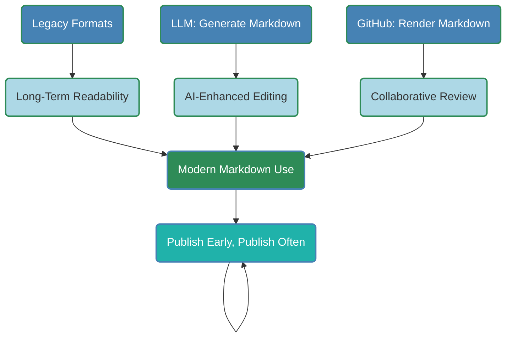
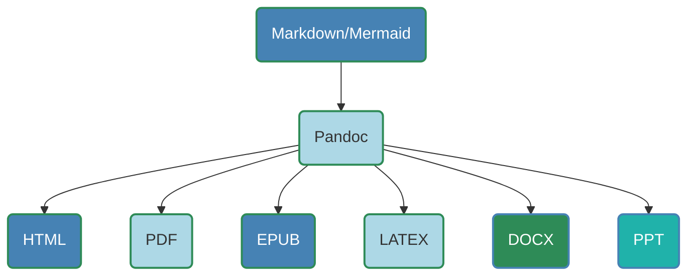
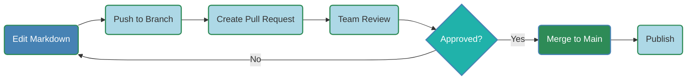
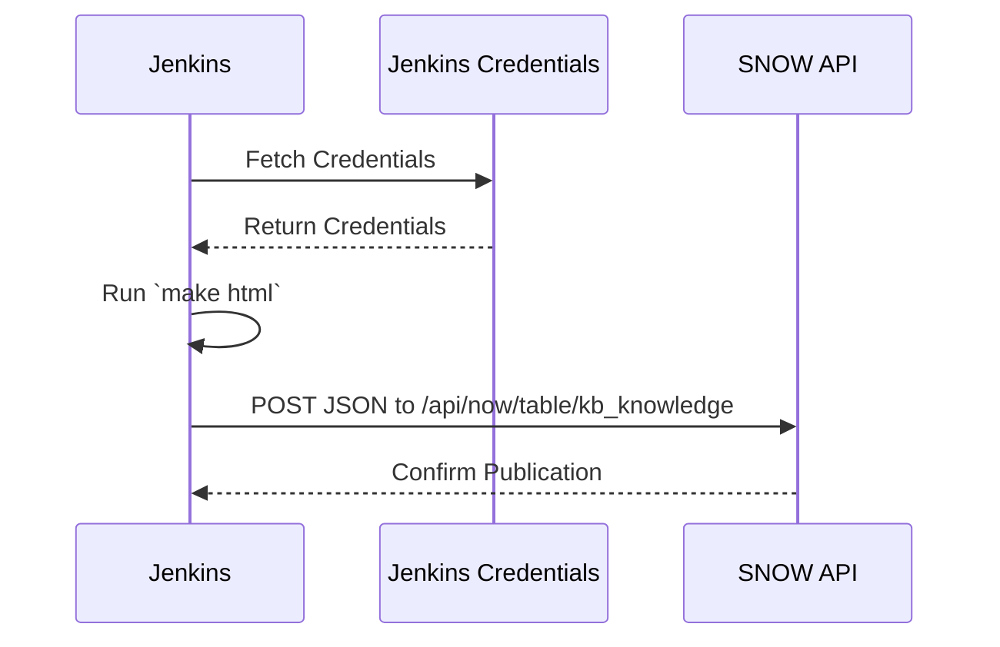

## Why Documentation Matters
- Good documentation backbone of successful projects.
- Enables knowledge sharing, onboarding, maintenance.
- Poor documentation causes confusion, inefficiency.
- Collaboration ensures accuracy, relevance.

---

## The Team Sport Mindset
- Everyone contributes: developers, writers, consumers.
- Collaborative tools streamline workflows.
- Version control and automation boost efficiency.
- Goal: Living, maintainable, up-to-date documentation.

---

## Workflow Overview
- **Input**: Subject Matter Experts, feedback loops.
- **Tools**: VS Code, Markdown, Mermaid, Pandoc, GitHub.
- **Steps**: Write, preview, collaborate, convert, publish.
- **Focus**: Simplicity, integration, longevity.

---

## Benefits of Markdown
- **Longevity**: Lightweight, durable.
    - Roff (1970s), \LaTeX (1984), Postscript (1982).
- **LLM Integration**: LLM suggestions.
- **GitHub Rendering**: Native Markdown/Mermaid support.
- **Fewer Distractions**: Focus on pure essense of document.
    - **WYSIWYG** vs **WYSIWYM**
- **Attributes**: Structured, portable, future-proof.
- **History**: Word processors fade; Markdown endures.

---

## Markdown Benefits Diagram



---

## Step 1: Create Content in VS Code


- Use VS Code with Markdown Preview Mermaid Support.
- Write Markdown for simplicity.
- Add Mermaid diagrams for workflows.
- Paste Clipboard images.
- Preview diagrams and images in real-time.


---

## Step 2: Pandoc Conversion Tool

- Renders Markdown to HTML, PDF, EPUB, etc.
- Uses `mermaid-filter` for diagram rendering.
- Set metadata values via YAML in document header.
- Example Command:

```bash
pandoc -F mermaid-filter -t html in.md -o out.html
```

---

## Step 3: Style with CSS
- Create .docx with styles (fonts, colors).
- Convert to HTML via Save As.
- Extract CSS from style section of HTML.
- Apply to HTML: `pandoc --css=styles.css`.
- Example: Headings, font sizes, colors.

---

## Step 4: GitHub Collaboration
- Host Markdown in GitHub repository.
- Use pull requests for reviews, edits.
- Track changes, maintain history.
- Native Markdown/Mermaid rendering.




---

## Step 5: Automate Conversion with Makefile
- Automates conversions, Git operations.
- Tasks: PDF, HTML, EPUB; push; clean.
- Commands: `make all`, `make pdf`, `make html`, `make epub`, `make push`, `make clean`.

```makefile
.PHONY: all pdf epub html push clean check-mermaid

all: pdf html epub

check-mermaid:
	@command -v pandoc-mermaid-filter >/dev/null ||   \
    { echo "Error: mermaid-filter not installed.      \
    Run 'npm i -g mermaid-filter'"; exit 1; }
```

---

```makefile
check-mermaid: (cont)
	@command -v mmdc >/dev/null ||                    \
    { echo "Error: mermaid-cli not installed.         \
    Run 'npm i -g @mermaid-js/mermaid-cli'"; exit 1; }

pdf: check-mermaid
	pandoc -F mermaid-filter -t pdf in.md -o out.pdf  \
    --pdf-engine=pdflatex

html: check-mermaid
	pandoc -F mermaid-filter -s --css=styles.css      \
    in.md -o in.html
```

---


```makefile
epub: check-mermaid
	mmdc -i in.md -o temp.md --config mermaid.json
	pandoc temp.md -o out.epub
	rm temp.md

push:
	git commit -m "Update docs" -a && git push

clean:
	rm -f *.pdf *.html *.epub temp.md
```

---

## Step 6: Publish to ServiceNow KB
- **Manual**: Paste HTML into SNOW KB editor, update, preview, upload images, submit.
- **Automatic (Jenkins CI/CD)**:
  - Pipeline:
    - **Checkout**: GitHub repo branch
    - **Build**: Run `make html`
    - **Publish**: POST JSON to ServiceNow API
  - Store secrets in Jenkins Credentials Plugin.
- **Alternative**: GitHub Actions (`make html` YAML workflow, API POST) -- not currently enabled.

---

## Sequence Diagram



---

## Next Steps
- **Proof of Concept**: Automate publishing with Jenkins.
- **GitHub Actions**: Request enablement for simpler CI/CD.
- **Expand LLM Use**:
     - AI Auto-generated drafts.
     - Documentation Taxonomy
- **Enhanced Indexing**:
    - Perm Decision Tree Builder and FreePlane.
    - Categorize by topic, project, etc.
    - Result: SNOW KB Mind Map Search Tree

---

## Conclusion
- Collaborative documentation drives success.
- Markdown ensures longevity, LLM integration.
- VS Code, Pandoc, GitHub, Jenkins streamline workflows.
- Mermaid diagrams and css themes enhance clarity.
- Let’s make documentation a team sport!
