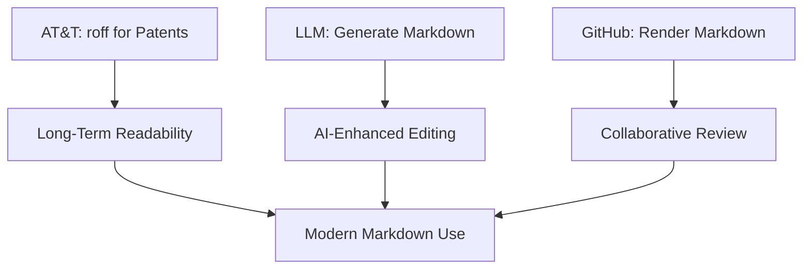
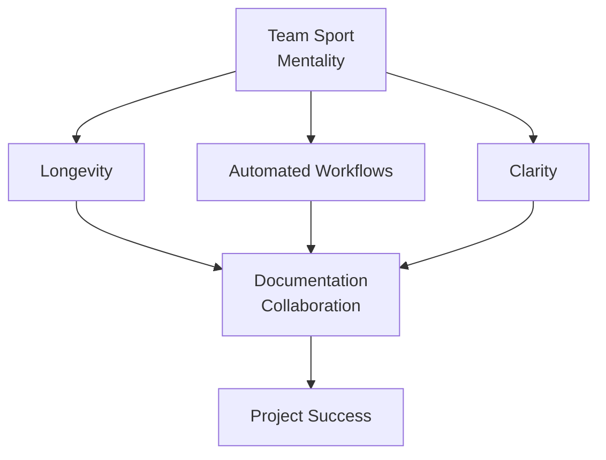

---
title: Documentation Should Be A Team Sport
subtitle: Creating Collaborative Technical Documentation
author: Rick Holbert
date: 13 August 2025
theme: PaloAlto
colortheme: whale
fonttheme: professionalfonts
---

## Why Documentation Matters
- Backbone of project success.
- Enables knowledge sharing, onboarding, maintenance.
- Poor documentation causes confusion, inefficiency.
- Team collaboration ensures accuracy, relevance.

---

## The Team Sport Mindset
- Everyone contributes: developers, writers, users.
- Collaborative tools streamline workflows.
- Version control and automation boost efficiency.
- Goal: Living, maintainable documentation.

---

## Workflow Overview
- **Tools**: VS Code, Markdown, Mermaid, Pandoc, GitHub, Jenkins.
- **Steps**: Write, preview, collaborate, convert, publish.
- Focus: Simplicity, integration, longevity.

---

## Benefits of Markdown
- **Longevity**: Lightweight, durable (e.g., AT&T’s roff, 1970s, readable).
- **LLM Integration**: Simplifies AI-assisted editing (e.g., LLM suggestions).
- **GitHub Rendering**: Native Markdown/Mermaid support.
- Structured, portable, future-proof.
- Word processors fade; Markdown endures.

---

## Markdown Benefits Workflow

---

## The Big Picture

---
