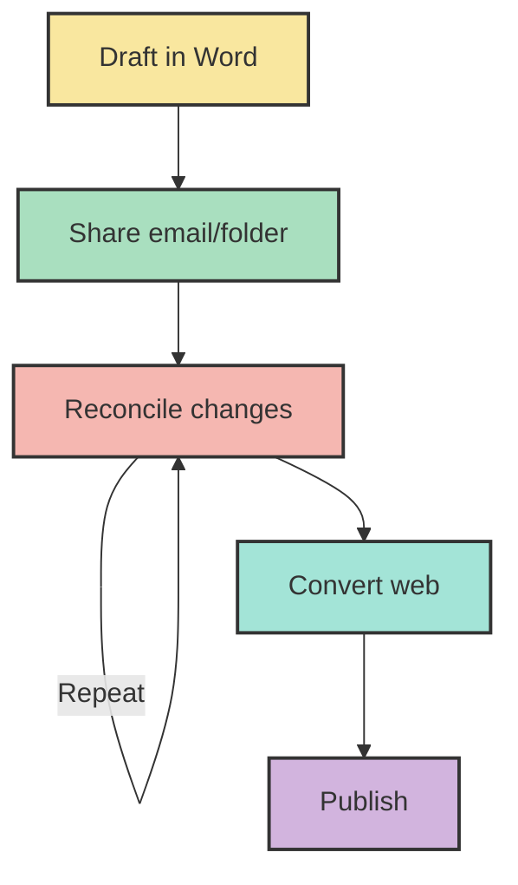
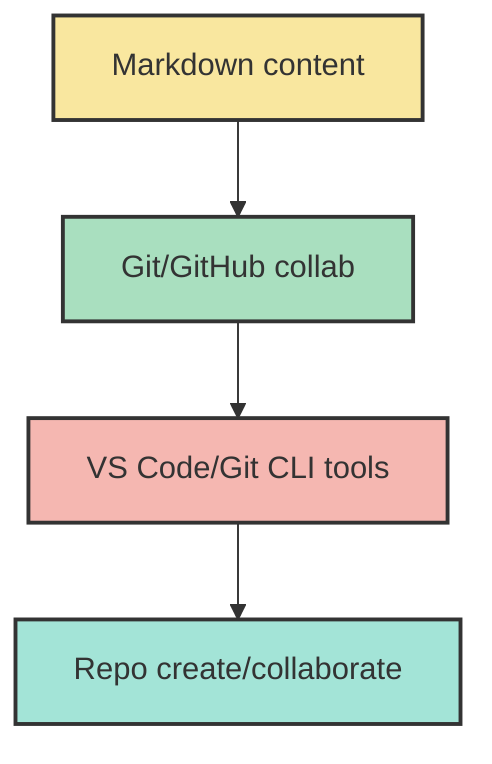
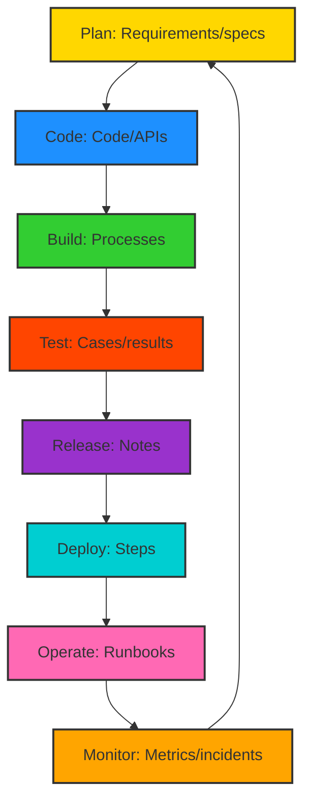
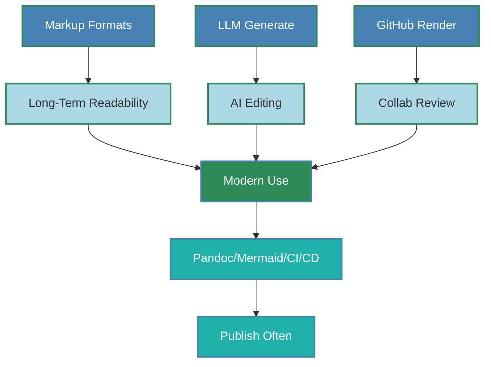
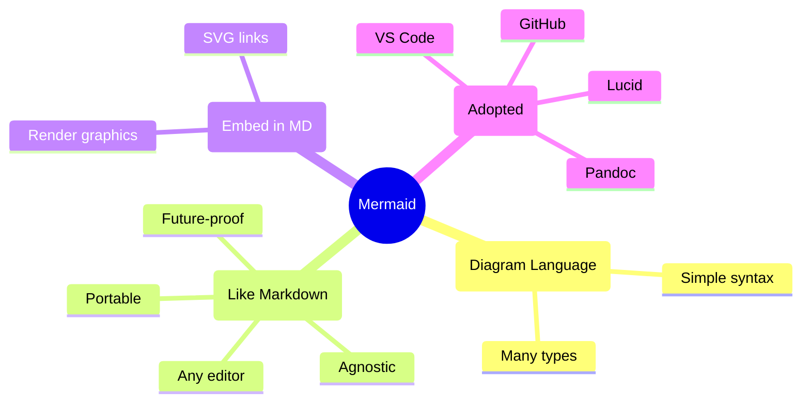
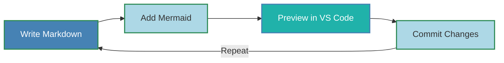
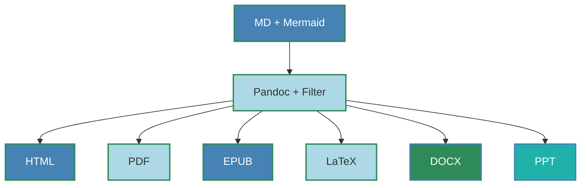
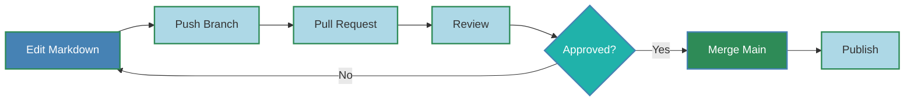
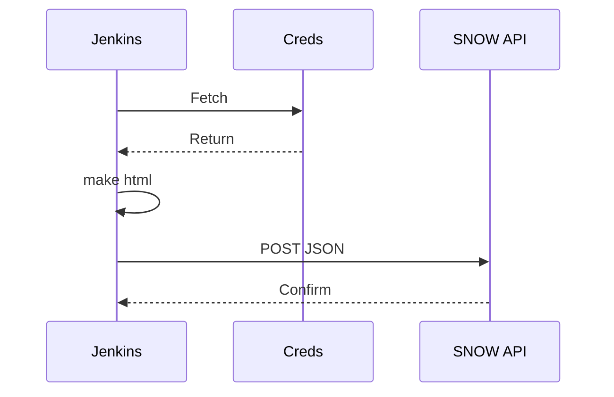
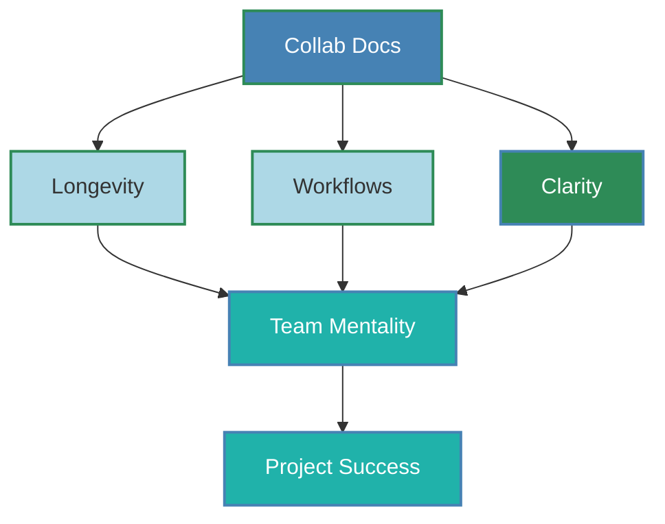

```markdown
---
title: "Documentation: A Team Sport"
subtitle: "Collaborative Environment for Document Publication"
author: "Rick Holbert"
date: "August 10, 2025"
theme: "PaloAlto"
colortheme: "whale"
fonttheme: "professionalfonts"
header-includes:
  - \usepackage{hyperref}
---

# Overview

- Backbone of Projects
- Knowledge Sharing
- Pitfalls of Poor Docs
- Bus Factor Risks
- Trained for Paper (Issue)
- Collaboration Benefits
- User Experience Boost
- Best Practices
- Life Cycle
- Team Sport Mindset
- Workflow Tools
- Markdown Authoring
- Mermaid Diagrams
- VS Code Editing
- Pandoc Conversion
- CSS Styling
- GitHub Collaboration
- Makefile Automation
- SNOW KB Publishing
- Next Steps
- Summary
- Key Takeaways

---

# Documentation: Backbone of Success

- Clarity: Aligns team on goals, processes, tech details.
- Scalability: Guides new contributors as projects grow.
- Decisions: Tracks "why" to avoid repeated errors.
- Risks: Ensures compliance in regulated fields.

**Tech Example**: API docs enable seamless integration, cut debug time.

---

# Knowledge Sharing & Onboarding

- Democratizes info: Reduces expert dependency.
- Speeds onboarding: Quick grasp of workflows/tools.
- Aids maintenance: Simplifies troubleshooting.
- Future-proofs: Preserves knowledge amid changes.

**Tech Example**: README with setup scripts onboards engineers fast.

---

# Pitfalls of Poor Documentation

- Confusion: Leads to errors, miscommunication.
- Inefficiency: Time wasted reverse-engineering.
- Knowledge loss: Gaps when experts leave (bus factor).
- Costs: Builds technical debt, rework.

**Tech Example**: Undocumented code wastes hours on logic decoding.

---

# Bus Factor Defined

- Measure: Key individuals whose absence stalls project.
- Low (1-2): High risk, concentrated knowledge.
- High (5+): Resilient, distributed info.
- Link to Docs: Poor docs lower factor; good docs raise it.

**Mitigation**:
- Document processes/code/decisions.
- Cross-train teams.
- Use wikis/Git repos.
- Pair programming/reviews.

**Tech Example**: Solo architect knowledge → Factor 1; Documented + shared → Higher resilience.

---

# We've Been Trained for Paper

**Credit**: Ben Balter (2012)  
**Source**: [https://ben.balter.com/2012/10/19/we-ve-been-trained-to-make-paper/](https://ben.balter.com/2012/10/19/we-ve-been-trained-to-make-paper/)

- Trained for print, not web/digital.
- Tools (e.g., Word): 1980s print focus (margins, breaks); weak on hyperlinks, responsiveness.
- Digital dominance: Most docs consumed online.

---

# Flawed Workflow in Paper Tools

Legacy process:
1. Draft in Word.
2. Share email/folder.
3. Reconcile manually.
4. Repeat to finalize.
5. Convert web format.
6. Publish.

**Issue**: Print-first; web retrofit.



---

# Why Print Tools Fail Technically

- Word: Physical focus; ignores web (responsiveness, readability).
- Proprietary (.docx): Mixes content/formatting; software-locked.
- Analogy: Water from filtered Coke – inefficient.

**Challenges**:
- File chaos: `doc_2012_final2.docx`.
- No history: Unclear edits, no simultaneous work, no branches.

---

# Solution: Version Control & Web-First

- Git: 1970s origin; tracks changes (character-level), branches, discussions.
- Free, dev-standard.

Web-first flow:
1. Markdown: Text-based content.
2. Git/GitHub: Collab, control.
3. Tools: VS Code (edit), Git CLI.
4. Repo: Create, collaborate.



- Shift: Web-first; pure content with Markdown.
- Break proprietary traps; focus essence.

**Credit**: Ben Balter (2012).

---

# Collaboration Benefits

- Accuracy: Multi-perspectives catch gaps.
- Relevance: Tailors for devs/users.
- Improvement: Git/wikis for updates.
- Ownership: Shared maintenance.

**Tech Example**: Cross-team wiki ensures comprehensive docs.

---

# User Experience Enhancement

- Empowers: Self-service guides cut support.
- Trust: Pro docs reflect quality.
- Reduces errors: Intuitive instructions.
- Adoption: Easy learning boosts uptake.

**Tech Example**: Tool manual slashes tickets.

---

# Best Practices

- Concise: Simple language, visuals.
- Organized: Logical structure, searchable.
- Updates: Living docs, owners assigned.
- Templates: Standardize (README, SOPs, APIs).
- Test: Validate with users.

---

# Documentation Life Cycle



---

# Team Sport Mindset

- All contribute: Devs, writers, users.
- Tools: Streamline collab.
- Versioning/Automation: Efficiency.
- Goal: Living, maintainable docs.

---

# Workflow Overview

- Input: SMEs, feedback.
- Tools: VS Code, Markdown, Mermaid, Pandoc, GitHub.
- Steps: Write, preview, collab, convert, publish.
- Focus: Simplicity, integration, CI/CD.

---

# Markdown: Core Authoring

- Lightweight markup: Structure text.
- WYSIWYM: Meaning-focused.
- Benefits: Readable, durable, AI-integrated, GitHub-rendered.
- History: Outlasts word processors.



---

# Mermaid: Diagram Language

- Text-based: Simple syntax.
- Like Markdown: Portable, editor-agnostic.
- Embed in MD: Renders to graphics/SVG (clickable).
- Supported: GitHub, Pandoc, VS Code.

Types: Sequence, Gantt, Flowchart, Class, State, ER, Journey, Mindmap, Timeline, Requirement, Git Graph, Pie, Quadrant, Sankey, Block, C4.



---

# Step 1: VS Code Content Creation



- Extensions: Markdown Preview Mermaid.
- Add diagrams/workflows.
- Paste screenshots/links.
- Real-time preview.

---

# Step 2: Pandoc Conversion



- Renders to formats.
- YAML metadata.
- Command: `pandoc -F mermaid-filter in.md -o out.html`.

---

# Step 3: CSS Styling

- From Word: Save as HTML, extract CSS.
- Tool: `pip install html2css; html2css -i html -o css`.
- Apply: `--css=style.css`.
- Controls: Fonts, colors, headings.

Command: `pandoc -F mermaid-filter --css=style.css in.md -o out.html`.

---

# Step 4: GitHub Collaboration



- Repo host: Track changes.
- PRs: Reviews/edits.
- Native rendering.

---

# Step 5: Makefile Automation

- Tasks: html, push, all.
- Example:

```makefile
.PHONY: all html push

all: html push

html: 
	pandoc -F mermaid-filter -s --css=styles.css in.md -o in.html

push:
	git commit -am "Update docs" && git push
```

- Run: `make all`.

---

# Step 6: SNOW KB Publishing

- Manual: Paste HTML, update, preview, upload images, submit.
- Auto: Jenkins CI/CD – Checkout, build (make html), POST to API.
- Secrets: Jenkins Credentials.
- Alt: Makefile/curl with KeePass; GitHub Actions (YAML workflow, API POST).



---

# Next Steps

- PoC: Jenkins auto-publish.
- Enable GitHub Actions for CI/CD.
- Expand AI: Drafts, taxonomy.
- Improve CSS.
- Indexing: Decision trees, FreePlane mind maps; categorize topics/projects.

---

# Summary



---

# Key Takeaways

- Strategic asset: Sharing, onboarding, maintenance.
- Avoid pitfalls: Confusion, costs.
- Collab: Accuracy, UX boost.
- Mindset: Team sport.
- Tools: Markdown, Mermaid, Git, Pandoc, Automation.

**Action**: Invest early in collab docs – save time, empower teams.
```