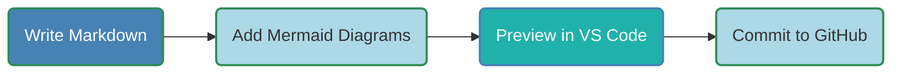

## Why Documentation Matters
- Good documentation; the backbone of successful projects.
- Enables knowledge sharing, onboarding, maintenance.
- Poor documentation results in confusion, inefficiency.
- Collaboration ensures accuracy, relevance.

---

## The Team Sport Mindset
- Everyone contributes: developers, writers, consumers.
- Collaborative tools streamline workflows.
- Version control and automation boost efficiency.
- Goal: Living, maintainable, up-to-date documentation.

---

## Workflow Overview
- **Input**: Subject Matter Experts, feedback loops.
- **Tools**: VS Code, Markdown, Mermaid, Pandoc, GitHub.
- **Steps**: Write, preview, collaborate, convert, publish.
- **Focus**: On simplicity, structure, integration, longevity.

---

## Benefits of Markdown
- **Longevity**: Markup languages are lightweight, durable.
    - Runoff (1960s), Postscript (1982), \LaTeX (1984)
- **LLM Integration**: LLM suggestions, editor plugins.
- **GitHub Rendering**: Native Markdown/Mermaid support.
- **Fewer Distractions**: Focus on pure essense of document.
    - **WYSIWYG** vs **WYSIWYM**
- **Attributes**: Structured, portable, future-proof.
- **History**: Word processors fade; Markup languages endure.

---

## Markdown Benefits Diagram


---

## Sample Mermaid Diagram Types

- Sequence Diagram - Actor/Object interaction over time.
- Gantt Chart - Represents project schedules and tasks.
- Flowchart - Visualizes processes or workflows.
- Class Diagram - Models class structures and relationships.
- State Diagram - Represents state machines.
- Entity-Relationship Diagram - Database relationships.
- User Journey Diagram - User interactions and experiences.
- Mindmap - Displays hierarchical information.
- Timeline - Shows events in chronological order.
- Requirement Diagram - System requirements.
- Git Graph - Visualizes Git repository commit history.
- Pie Chart - Shows data in a circular, proportional format.
- Quadrant Chart - Compares data in four quadrants.
- Sankey Diagram - Shows flow magnitudes between nodes.
- Block Diagram - System component interactions.
- C4 Diagram - Models software architecture.

---

## Step 1: Create Content in VS Code


- Use VS Code with Markdown Preview Mermaid Support.
- Write Markdown for simplicity.
- Add Mermaid diagrams for workflows, etc.
- Paste screenshots from clipboard.
- Add other bitmap images by reference.
- Preview diagrams and images in real-time.


---

## Step 2: Pandoc Conversion Tool

- Renders Markdown to HTML, PDF, EPUB, etc.
- Uses `mermaid-filter` for diagram rendering.
- Use YAML formatted metadata values in document header.
- Example Command:

```bash
pandoc -F mermaid-filter -t html in.md -o out.html
```

---

## Step 3: Style with CSS
- Create Word document with styles (fonts, colors).
- Convert DOCX to HTML via Save As.
- Extract CSS from HTML style section.

```bash
pip install html2css
html2css --input saved_as.html --output style.css
```
- Apply to HTML: `pandoc --css=style.css`.
- Example: Headings, font sizes, colors.
- Example Command:

```bash
pandoc -F mermaid-filter                         \
       --css=style.css                           \
       --to html                                 \
       --out out.html in.md
```

---

## Step 4: GitHub Collaboration


- Host Markdown in GitHub repository.
- Use pull requests for reviews, edits.
- Track changes, maintain history.
- Native Markdown/Mermaid rendering.

---

## Step 5: Automate Conversion with Makefile
- Automates conversions, Git operations.
- Tasks: all, html, push.
- Commands: `make all`, `make html`, `make push`.

```makefile
.PHONY: all html push

all: pdf push

html: 
	pandoc -F mermaid-filter -s --css=styles.css      \
    in.md -o in.html

push:
	git commit -m "Update docs" -a && git push
```

---

## Step 6: Publish to ServiceNow KB
- **Manual**:
    - **Paste** HTML into SNOW KB editor
    - **Uupdate**
    - **Preview**
    - **Upload images**
    - **Submit** for review
- **Automatic**: Jenkins CI/CD Pipeline:
  - **Checkout**: GitHub repo branch
  - **Build**: Run `make html`
  - **Publish**: POST JSON to ServiceNow API
  - **Secrets**: Stored in Jenkins Credentials Plugin.
- **Alternative**: GitHub Actions (`make html` YAML workflow, API POST) -- not currently enabled.

---

## CI/CD Sequence Diagram


---

## Next Steps

- **Proof of Concept**: Automate publishing with Jenkins.
- **GitHub Actions**: Request enablement for simpler CI/CD.
- **Expand LLM Use**:
     - AI Auto-generated drafts.
     - Documentation Taxonomy
- **Enhanced Indexing**:
    - Perm Decision Tree Builder and FreePlane.
    - Categorize by topic, project, etc.
    - Result: SNOW KB Mind Map Search Tree

---


## Summary


---

## Conclusion

- Collaborative Documentation drives success.
- Markdown ensures longevity, good LLM integration.
- VS Code, Pandoc, GitHub, Jenkins streamline workflows.
- Mermaid diagrams and CSS themes enhance clarity.
- Let’s make documentation a team sport!
