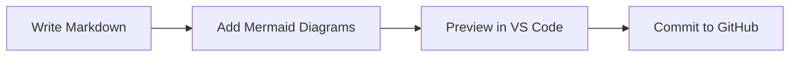
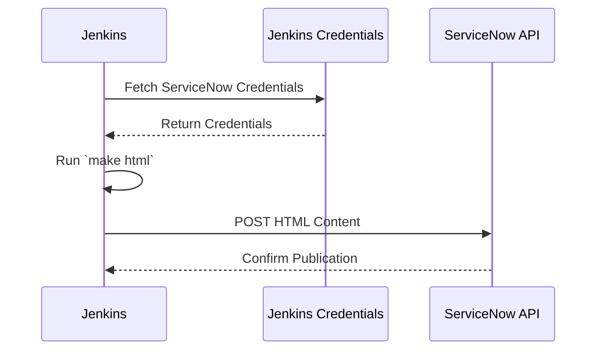

## Why Documentation Matters

- Documentation is the backbone of project success.
- Enables knowledge sharing, onboarding, and maintenance.
- Poor documentation leads to confusion and inefficiency.
- Team collaboration ensures accuracy and relevance.

------

## The Team Sport Mindset

- Everyone contributes: developers, writers, and users.
- Collaborative tools streamline the process.
- Version control and automation enhance efficiency.
- Goal: Create living, maintainable documentation.

------

## Workflow Overview

- Tools: VS Code, Markdown, Mermaid, Pandoc, GitHub.
- Steps: Write, preview, collaborate, convert, publish.
- Focus on simplicity, integration, and longevity.

------

## Benefits of Markdown

- Longevity: Lightweight markup ensures durability
- AT&T’s roff for patent documents dates from the 1970s, still readable today
- LLM Integration: Markdown’s simplicity enables AI-assisted editing and generation (e.g., LLM for content suggestions).
- GitHub Rendering: Native support for Markdown and Mermaid diagrams in GitHub for seamless collaboration.
- Encourages focus on document content and structure.
- Markdown: Structured, portable, future-proof format.
- Wordprocessors come and go -- Markdown endures.

------

## Markdown Benefits Workflow


------

## The Process
1. Write VS Code using Markdown

- Use VS Code with the preview plugin.
- Write documentation in Markdown for simplicity.
- Insert Mermaid diagrams for visual workflows.
- Preview diagrams in real-time for accuracy.

### Mermaid Diagram Example



------

1. Convert Markdown with Pandoc

- Pandoc converts Markdown to HTML, PDF, etc.
- Use mermaid-filter to render Mermaid diagrams.
- `pandoc -F mermaid-filter input.md -o output.pdf`
- Ensures diagrams are embedded in the final document.


Step 3: Styling with CSS from .docx

- Use a .docx file with desired styles (e.g., fonts, colors).
- Convert .docx to CSS using tools like html2css.
- Apply CSS to HTML output for consistent formatting.
- Example: Define heading styles, font sizes, and colors.

------

1. Collaboration with GitHub

- Host Markdown files in a GitHub repository.
- Use pull requests for team reviews and edits.
- Track changes and maintain version history.
- Markdown and Mermaid diagrams render natively.

### GitHub Collaboration Workflow


------

1. Automating with Makefile

- Create a Makefile to automate conversions.
- Example tasks: Convert Markdown to HTML/PDF, push to GitHub, etc.
- Simplifies repetitive tasks for the team.
- Commands: `make pdf, make html, or make push`

### Makefile Example

```makefile
pdf:
    pandoc -F mermaid-filter in.md -o out.pdf
html:
    pandoc -F mermaid-filter -s in.md -o out.html
push:
    git commit -m "my change message" -a && git push
```

Use `

------


1. Publish to ServiceNow KB

- **Manual**: Paste HTML into ServiceNow KB HTML editor, update, preview, upload images, submit for review.

- **Automatic (Jenkins CI/CD)**:

    - Jenkins pipeline: Check out GitHub repo, convert Markdown to HTML (make html), publish to ServiceNow KB via API.
    - Store API credentials in Jenkins Credentials Plugin.
    - Stages: Checkout, Build (Pandoc), Publish (ServiceNow API).

- **Alternative** Use GitHub Actions if enabled

------




------

## Next Steps

### Create Proof of Concept

- Use ServiceNow Knowledge Base API to publish documentation.
- Automate content updates with Jenkins CI/CD.
- Store API credentials securely in Jenkins.
- Ensure documentation is accessible to stakeholders.
- **Perm** Decision Tree Builder for domumentation indexing.

------

## Conclusion

- Documentation thrives with team collaboration.
- Use Markdown for longevity, LLM integration, image and diagram integration.
- VS Code, Pandoc, GitHub, and Make streamline the process.
- Mermaid diagrams add clarity and engagement.
- Together, we can make documentation a team sport!


